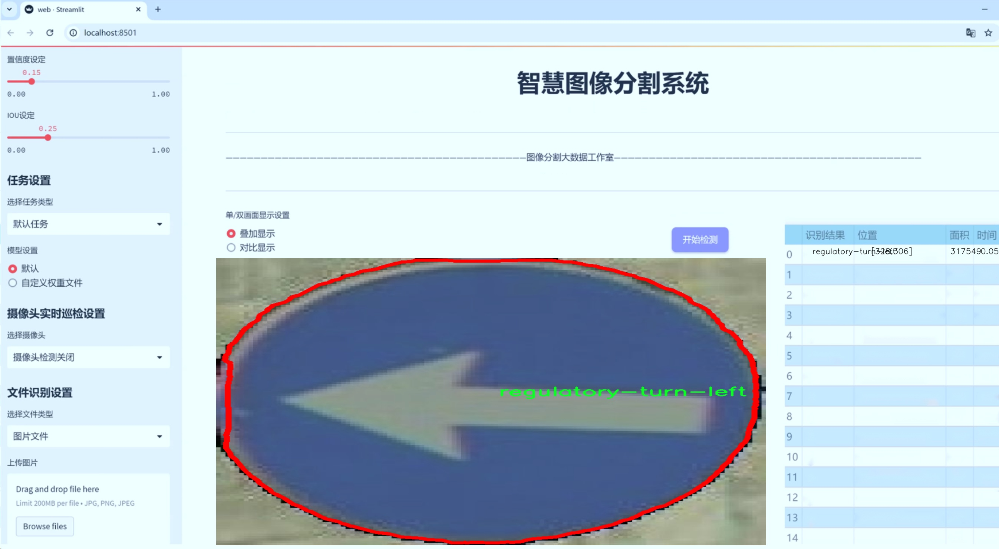
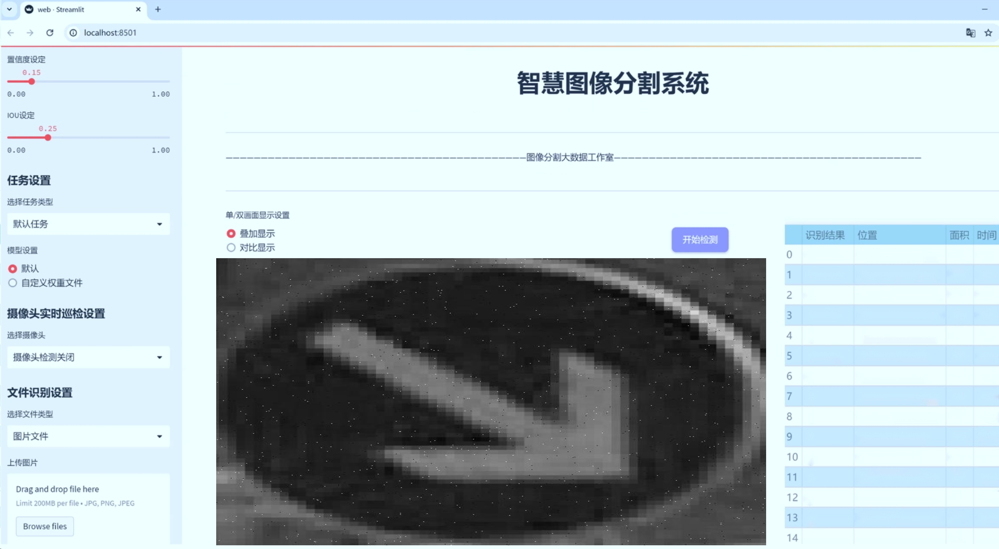
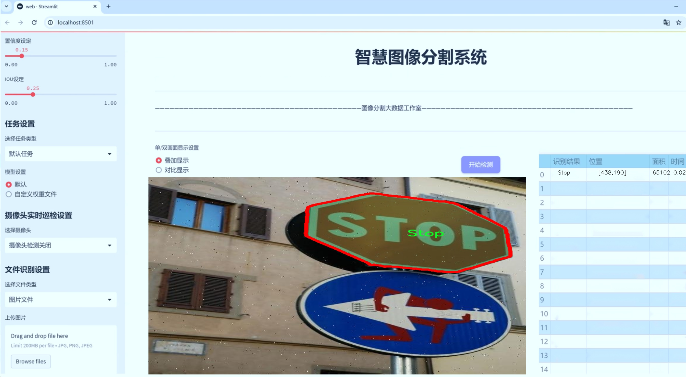
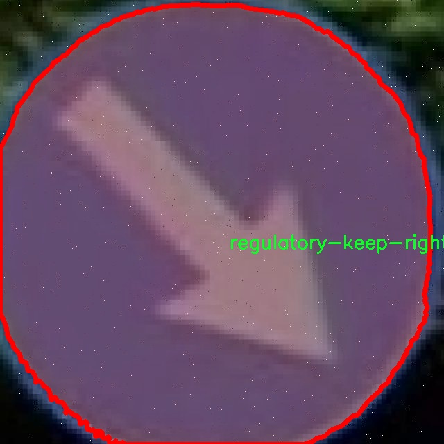
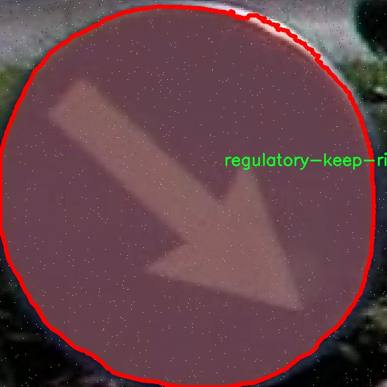
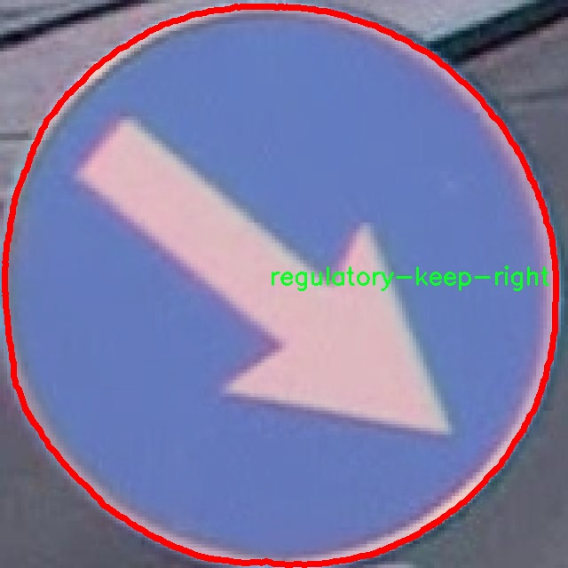
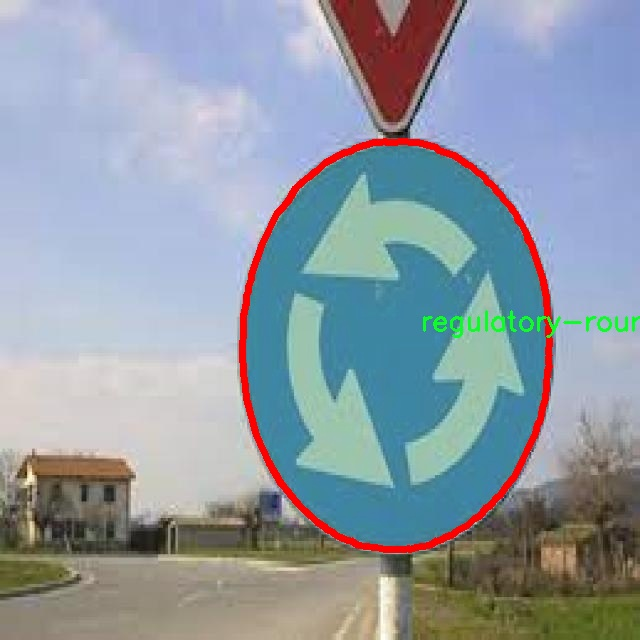
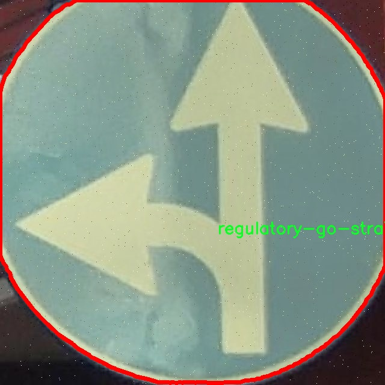

# 交通标志分割系统源码＆数据集分享
 [yolov8-seg-RevCol＆yolov8-seg-SPPF-LSKA等50+全套改进创新点发刊_一键训练教程_Web前端展示]

### 1.研究背景与意义

项目参考[ILSVRC ImageNet Large Scale Visual Recognition Challenge](https://gitee.com/YOLOv8_YOLOv11_Segmentation_Studio/projects)

项目来源[AAAI Global Al lnnovation Contest](https://kdocs.cn/l/cszuIiCKVNis)

研究背景与意义

随着城市化进程的加快，交通流量日益增加，交通安全问题愈发凸显。交通标志作为道路交通管理的重要组成部分，承担着引导和规范驾驶行为的关键角色。然而，传统的交通标志识别和分割方法在复杂环境下的准确性和实时性往往难以满足实际需求。因此，开发一种高效、准确的交通标志分割系统显得尤为重要。近年来，深度学习技术的迅猛发展为交通标志的自动识别和分割提供了新的解决方案，其中，YOLO（You Only Look Once）系列模型因其高效的实时检测能力而受到广泛关注。

YOLOv8作为YOLO系列的最新版本，具有更强的特征提取能力和更高的检测精度，适用于复杂的交通场景。然而，现有的YOLOv8模型在处理交通标志分割任务时，仍存在一定的局限性，例如对小型标志的识别能力不足、背景干扰对分割效果的影响等。因此，基于改进YOLOv8的交通标志分割系统的研究，旨在通过优化模型结构和训练策略，提高交通标志的分割精度和鲁棒性，从而为智能交通系统的建设提供有力支持。

本研究所使用的数据集包含1200张图像，涵盖15类交通标志，包括停止标志、禁止左转、禁止右转、直行、左转、右转、保持左侧、保持右侧、不允许掉头、环形交叉口、左转、右转、左或右转、让行和警告路面颠簸等。这些类别不仅涵盖了常见的交通标志，还包括一些特定的交通指示，能够有效地反映出不同交通场景下的需求。通过对这些标志的准确分割和识别，可以为自动驾驶、智能交通管理系统等应用提供重要的数据支持。

本研究的意义在于，通过改进YOLOv8模型，提升交通标志的分割精度，进而推动智能交通系统的发展。首先，准确的交通标志分割能够为自动驾驶车辆提供更为可靠的环境感知，减少交通事故的发生。其次，提升交通标志识别的准确性和实时性，有助于交通管理部门对交通流量进行有效监控和管理，提高城市交通的整体效率。此外，本研究还将为相关领域的研究提供参考，推动交通标志识别技术的进一步发展。

综上所述，基于改进YOLOv8的交通标志分割系统的研究，不仅具有重要的理论价值，也具备广泛的应用前景。通过对交通标志的精准分割与识别，将为智能交通系统的实现奠定坚实的基础，为构建安全、高效的交通环境贡献力量。

### 2.图片演示







##### 注意：由于此博客编辑较早，上面“2.图片演示”和“3.视频演示”展示的系统图片或者视频可能为老版本，新版本在老版本的基础上升级如下：（实际效果以升级的新版本为准）

  （1）适配了YOLOV8的“目标检测”模型和“实例分割”模型，通过加载相应的权重（.pt）文件即可自适应加载模型。

  （2）支持“图片识别”、“视频识别”、“摄像头实时识别”三种识别模式。

  （3）支持“图片识别”、“视频识别”、“摄像头实时识别”三种识别结果保存导出，解决手动导出（容易卡顿出现爆内存）存在的问题，识别完自动保存结果并导出到tempDir中。

  （4）支持Web前端系统中的标题、背景图等自定义修改，后面提供修改教程。

  另外本项目提供训练的数据集和训练教程,暂不提供权重文件（best.pt）,需要您按照教程进行训练后实现图片演示和Web前端界面演示的效果。

### 3.视频演示

[3.1 视频演示](https://www.bilibili.com/video/BV17g2UYWEbD/)

### 4.数据集信息展示

##### 4.1 本项目数据集详细数据（类别数＆类别名）

nc: 15
names: ['Stop', 'no-left-turn', 'no-right-turn', 'regulatory-go-straight', 'regulatory-go-straight-or-turn-left', 'regulatory-go-straight-or-turn-right', 'regulatory-keep-left', 'regulatory-keep-right', 'regulatory-no-u-turn', 'regulatory-roundabout', 'regulatory-turn-left', 'regulatory-turn-right', 'regulatory-turn-right-or-left', 'regulatory-yield', 'warning-reod-bump']


##### 4.2 本项目数据集信息介绍

数据集信息展示

在本研究中，我们使用的数据集名为“dataset”，其主要目的是为改进YOLOv8-seg的交通标志分割系统提供高质量的训练数据。该数据集包含15个不同类别的交通标志，涵盖了多种常见的交通指示和警告标志，旨在提高模型在实际应用中的准确性和鲁棒性。

数据集中包含的类别包括：停止标志（Stop）、禁止左转（no-left-turn）、禁止右转（no-right-turn）、直行指示（regulatory-go-straight）、直行或左转指示（regulatory-go-straight-or-turn-left）、直行或右转指示（regulatory-go-straight-or-turn-right）、保持左侧行驶（regulatory-keep-left）、保持右侧行驶（regulatory-keep-right）、禁止掉头（regulatory-no-u-turn）、环形交叉口指示（regulatory-roundabout）、左转指示（regulatory-turn-left）、右转指示（regulatory-turn-right）、左右转指示（regulatory-turn-right-or-left）、让行标志（regulatory-yield）以及警告路面颠簸（warning-reod-bump）。这些类别的选择不仅考虑了交通标志的普遍性和重要性，还考虑了在不同驾驶环境下的适用性。

数据集的构建过程包括了对交通标志的多样化采集，确保涵盖了不同地区、不同光照条件和不同天气状况下的标志图像。这种多样性对于训练一个能够在复杂环境中表现良好的模型至关重要。数据集中每个类别的样本数量经过精心设计，以确保模型在训练过程中能够充分学习到每个类别的特征，从而提高分割精度。

在数据预处理阶段，我们对图像进行了标准化处理，包括调整图像大小、增强对比度和应用随机裁剪等技术。这些步骤不仅有助于提高模型的泛化能力，还能有效减少过拟合的风险。此外，数据集中还包含了标注信息，采用了精确的边界框和分割掩码，以便于YOLOv8-seg模型进行有效的训练和评估。

通过使用“dataset”，我们期望能够提升YOLOv8-seg在交通标志分割任务中的表现，特别是在复杂的城市交通环境中。该数据集的设计理念和实施过程充分考虑了实际应用中的挑战，使得模型能够在真实世界中更好地识别和分割交通标志，从而为自动驾驶、智能交通系统等领域的进一步发展提供支持。

总之，“dataset”不仅是一个简单的图像集合，更是一个经过深思熟虑、精心设计的训练资源，旨在推动交通标志识别技术的进步。通过对数据集的充分利用，我们希望能够为交通安全和智能交通系统的实现贡献一份力量。











### 5.全套项目环境部署视频教程（零基础手把手教学）

[5.1 环境部署教程链接（零基础手把手教学）](https://www.bilibili.com/video/BV1jG4Ve4E9t/?vd_source=bc9aec86d164b67a7004b996143742dc)


[5.2 安装Python虚拟环境创建和依赖库安装视频教程链接（零基础手把手教学）](https://www.bilibili.com/video/BV1nA4VeYEze/?vd_source=bc9aec86d164b67a7004b996143742dc)

### 6.手把手YOLOV8-seg训练视频教程（零基础小白有手就能学会）

[6.1 手把手YOLOV8-seg训练视频教程（零基础小白有手就能学会）](https://www.bilibili.com/video/BV1cA4VeYETe/?vd_source=bc9aec86d164b67a7004b996143742dc)


按照上面的训练视频教程链接加载项目提供的数据集，运行train.py即可开始训练



     Epoch   gpu_mem       box       obj       cls    labels  img_size
     1/200     0G   0.01576   0.01955  0.007536        22      1280: 100%|██████████| 849/849 [14:42<00:00,  1.04s/it]
               Class     Images     Labels          P          R     mAP@.5 mAP@.5:.95: 100%|██████████| 213/213 [01:14<00:00,  2.87it/s]
                 all       3395      17314      0.994      0.957      0.0957      0.0843

     Epoch   gpu_mem       box       obj       cls    labels  img_size
     2/200     0G   0.01578   0.01923  0.007006        22      1280: 100%|██████████| 849/849 [14:44<00:00,  1.04s/it]
               Class     Images     Labels          P          R     mAP@.5 mAP@.5:.95: 100%|██████████| 213/213 [01:12<00:00,  2.95it/s]
                 all       3395      17314      0.996      0.956      0.0957      0.0845

     Epoch   gpu_mem       box       obj       cls    labels  img_size
     3/200     0G   0.01561    0.0191  0.006895        27      1280: 100%|██████████| 849/849 [10:56<00:00,  1.29it/s]
               Class     Images     Labels          P          R     mAP@.5 mAP@.5:.95: 100%|███████   | 187/213 [00:52<00:00,  4.04it/s]
                 all       3395      17314      0.996      0.957      0.0957      0.0845


### 7.50+种全套YOLOV8-seg创新点代码加载调参视频教程（一键加载写好的改进模型的配置文件）

[7.1 50+种全套YOLOV8-seg创新点代码加载调参视频教程（一键加载写好的改进模型的配置文件）](https://www.bilibili.com/video/BV1Hw4VePEXv/?vd_source=bc9aec86d164b67a7004b996143742dc)

### 8.YOLOV8-seg图像分割算法原理

原始YOLOv8-seg算法原理

YOLOv8-seg算法是2023年由Ultralytics团队推出的一款先进的目标检测与分割模型，它在YOLO系列的基础上进行了多项创新与改进，尤其是在图像分割任务中表现出色。YOLOv8的设计理念是将目标检测与图像分割的任务有机结合，以实现更高效的视觉识别能力。该算法不仅在精度和速度上达到了新的高度，还通过引入多种现代技术，提升了模型的鲁棒性和泛化能力。

首先，YOLOv8-seg在输入处理阶段进行了优化。传统的YOLO模型通常使用Mosaic数据增强技术来提升模型的鲁棒性，但YOLOv8-seg在训练的最后阶段停止使用Mosaic增强，以避免对数据真实分布的破坏。这一策略使得模型在学习过程中能够更好地捕捉到目标的真实特征，进而提高了检测和分割的精度。

在网络结构方面，YOLOv8-seg采用了C2f模块替代了之前的C3模块。C2f模块的设计灵感来源于YOLOv7中的ELAN结构，增加了更多的跳层连接。这种设计不仅丰富了梯度流信息，还在保持模型轻量化的同时，提升了特征提取的能力。此外，YOLOv8-seg依然保留了SPPF（Spatial Pyramid Pooling Fast）模块，这一模块在提升模型性能的同时，显著减少了执行时间，使得整体检测速度得以提升。

在颈部网络的设计上，YOLOv8-seg同样进行了重要的改进。所有的C3模块被替换为C2f模块，并且在上采样之前删除了多余的卷积连接层。这一系列的改动使得特征图的融合更加高效，确保了不同尺度特征的有效利用，从而提升了模型在复杂场景下的表现。

YOLOv8-seg的头部网络采用了解耦头的设计思路，分为两个并行的分支，分别负责提取类别和位置特征。这种设计的核心在于分类任务与定位任务的侧重点不同，分类任务更加关注特征图中提取到的特征与已有类别的相似性，而定位任务则注重边界框与真实框之间的关系。通过这种解耦设计，YOLOv8-seg在收敛速度和预测精度上都有了显著提升。

值得一提的是，YOLOv8-seg采用了无锚框结构，这一创新使得模型能够直接预测目标的中心位置，而不再依赖于传统的锚框设计。这种方法简化了模型的结构，提高了检测精度。此外，YOLOv8-seg引入了任务对齐学习（Task Alignment Learning，TAL）机制，通过分类分数和IOU的高次幂乘积来衡量任务对齐程度。这一机制确保了在分类和定位损失函数中，既考虑了分类的准确性，也关注了定位的精度，从而实现了更为全面的性能提升。

在模型的检测结果上，YOLOv8-seg在COCO数据集上取得了优异的表现。通过对比不同尺寸模型的mAP（mean Average Precision）指标，YOLOv8-seg展现了在参数量没有显著增加的情况下，依然能够实现更高的检测精度。同时，在推理速度方面，YOLOv8-seg的表现也优于其他YOLO系列模型，证明了其在实时检测任务中的应用潜力。

综合来看，YOLOv8-seg算法通过对输入处理、网络结构、特征提取和损失计算等多个方面的创新，成功地将目标检测与图像分割任务结合在一起。其高效的设计使得该模型在苹果采摘等实际应用中展现出色的视觉识别能力，能够快速、准确地检测和定位目标。随着YOLOv8-seg的不断发展与完善，未来在更多复杂场景下的应用将会更加广泛，推动目标检测与分割领域的进一步进步。


### 9.系统功能展示（检测对象为举例，实际内容以本项目数据集为准）

图9.1.系统支持检测结果表格显示

  图9.2.系统支持置信度和IOU阈值手动调节

  图9.3.系统支持自定义加载权重文件best.pt(需要你通过步骤5中训练获得)

  图9.4.系统支持摄像头实时识别

  图9.5.系统支持图片识别

  图9.6.系统支持视频识别

  图9.7.系统支持识别结果文件自动保存

  图9.8.系统支持Excel导出检测结果数据


### 10.50+种全套YOLOV8-seg创新点原理讲解（非科班也可以轻松写刊发刊，V11版本正在科研待更新）

#### 10.1 由于篇幅限制，每个创新点的具体原理讲解就不一一展开，具体见下列网址中的创新点对应子项目的技术原理博客网址【Blog】：


[10.1 50+种全套YOLOV8-seg创新点原理讲解链接](https://gitee.com/qunmasj/good)

#### 10.2 部分改进模块原理讲解(完整的改进原理见上图和技术博客链接)【如果此小节的图加载失败可以通过CSDN或者Github搜索该博客的标题访问原始博客，原始博客图片显示正常】
### YOLOv8算法原理
YOLOv8算法由Glenn-Jocher 提出，是跟YOLOv3算法、YOLOv5算法一脉相承的，主要的改进点如下:
(1)数据预处理。YOLOv8的数据预处理依旧采用YOLOv5的策略,在训练时，主要采用包括马赛克增强(Mosaic)、混合增强(Mixup)、空间扰动(randomperspective)以及颜色扰动(HSV augment)四个增强手段。
(2)骨干网络结构。YOLOv8的骨干网络结构可从YOLOv5略见一斑，YOLOv5的主干网络的架构规律十分清晰，总体来看就是每用一层步长为2的3×3卷积去降采样特征图，接一个C3模块来进一步强化其中的特征，且C3的基本深度参数分别为“3/6/9/3”，其会根据不同规模的模型的来做相应的缩放。在的YOLOv8中，大体上也还是继承了这一特点，原先的C3模块均被替换成了新的C2f模块，C2f 模块加入更多的分支，丰富梯度回传时的支流。下面展示了YOLOv8的C2f模块和YOLOv5的C3模块，其网络结构图所示。


(3)FPN-PAN结构。YOLOv8仍采用FPN+PAN结构来构建YOLO的特征金字塔，使多尺度信息之间进行充分的融合。除了FPN-PAN里面的C3模块被替换为C2f模块外，其余部分与YOLOv5的FPN-PAN结构基本一致。
(4)Detection head结构。从 YOLOv3到 YOLOv5，其检测头一直都是“耦合”(Coupled)的,即使用一层卷积同时完成分类和定位两个任务，直到YOLOX的问世， YOLO系列才第一次换装“解耦头”(Decoupled Head)。YOLOv8也同样也采用了解耦头的结构，两条并行的分支分别取提取类别特征和位置特征，然后各用一层1x1卷积完成分类和定位任务。YOLOv8整体的网络结构由图所示。


(5)标签分配策略。尽管YOLOv5设计了自动聚类候选框的一些功能，但是聚类候选框是依赖于数据集的。若数据集不够充分，无法较为准确地反映数据本身的分布特征，聚类出来的候选框也会与真实物体尺寸比例悬殊过大。YOLOv8没有采用候选框策略，所以解决的问题就是正负样本匹配的多尺度分配。不同于YOLOX所使用的 SimOTA，YOLOv8在标签分配问题上采用了和YOLOv6相同的TOOD策略，是一种动态标签分配策略。YOLOv8只用到了targetboze。和target scores，未含是否有物体预测，故 YOLOv8的损失就主要包括两大部分∶类别损失和位置损失。对于YOLOv8，其分类损失为VFLLoss(Varifocal Loss)，其回归损失为CIoU Loss 与 DFL Loss 的形式。
其中 Varifocal Loss定义如下:


其中p为预测的类别得分，p ∈ [0.1]。q为预测的目标分数(若为真实类别，则q为预测和真值的 loU;若为其他类别。q为0 )。VFL Loss使用不对称参数来对正负样本进行加权，通过只对负样本进行衰减，达到不对等的处理前景和背景对损失的贡献。对正样本，使用q进行了加权，如果正样本的GTiou很高时,则对损失的贡献更大一些，可以让网络聚焦于那些高质量的样本上，即训练高质量的正例对AP的提升比低质量的更大一些。对负样本，使用p进行了降权，降低了负例对损失的贡献，因负样本的预测p在取次幂后会变得更小，这样就能够降低负样本对损失的整体贡献。

### 动态蛇形卷积Dynamic Snake Convolution

参考论文： 2307.08388.pdf (arxiv.org)

血管、道路等拓扑管状结构的精确分割在各个领域都至关重要，确保下游任务的准确性和效率。 然而，许多因素使任务变得复杂，包括薄的局部结构和可变的全局形态。在这项工作中，我们注意到管状结构的特殊性，并利用这些知识来指导我们的 DSCNet 在三个阶段同时增强感知：特征提取、特征融合、 和损失约束。 首先，我们提出了一种动态蛇卷积，通过自适应地关注细长和曲折的局部结构来准确捕获管状结构的特征。 随后，我们提出了一种多视图特征融合策略，以补充特征融合过程中多角度对特征的关注，确保保留来自不同全局形态的重要信息。 最后，提出了一种基于持久同源性的连续性约束损失函数，以更好地约束分割的拓扑连续性。 2D 和 3D 数据集上的实验表明，与多种方法相比，我们的 DSCNet 在管状结构分割任务上提供了更好的准确性和连续性。 我们的代码是公开的。 
主要的挑战源于细长微弱的局部结构特征与复杂多变的全局形态特征。本文关注到管状结构细长连续的特点，并利用这一信息在神经网络以下三个阶段同时增强感知：特征提取、特征融合和损失约束。分别设计了动态蛇形卷积（Dynamic Snake Convolution），多视角特征融合策略与连续性拓扑约束损失。 

我们希望卷积核一方面能够自由地贴合结构学习特征，另一方面能够在约束条件下不偏离目标结构太远。在观察管状结构的细长连续的特征后，脑海里想到了一个动物——蛇。我们希望卷积核能够像蛇一样动态地扭动，来贴合目标的结构。

我们希望卷积核一方面能够自由地贴合结构学习特征，另一方面能够在约束条件下不偏离目标结构太远。在观察管状结构的细长连续的特征后，脑海里想到了一个动物——蛇。我们希望卷积核能够像蛇一样动态地扭动，来贴合目标的结构。


### DCNV2融入YOLOv8
DCN和DCNv2（可变性卷积）
网上关于两篇文章的详细描述已经很多了，我这里具体的细节就不多讲了，只说一下其中实现起来比较困惑的点。（黑体字会讲解）

DCNv1解决的问题就是我们常规的图像增强，仿射变换（线性变换加平移）不能解决的多种形式目标变换的几何变换的问题。如下图所示。

可变性卷积的思想很简单，就是讲原来固定形状的卷积核变成可变的。如下图所示：


首先来看普通卷积，以3x3卷积为例对于每个输出y(p0)，都要从x上采样9个位置，这9个位置都在中心位置x(p0)向四周扩散得到的gird形状上，(-1,-1)代表x(p0)的左上角，(1,1)代表x(p0)的右下角，其他类似。

用公式表示如下：


可变性卷积Deformable Conv操作并没有改变卷积的计算操作，而是在卷积操作的作用区域上，加入了一个可学习的参数∆pn。同样对于每个输出y(p0)，都要从x上采样9个位置，这9个位置是中心位置x(p0)向四周扩散得到的，但是多了 ∆pn，允许采样点扩散成非gird形状。


偏移量是通过对原始特征层进行卷积得到的。比如输入特征层是w×h×c，先对输入的特征层进行卷积操作，得到w×h×2c的offset field。这里的w和h和原始特征层的w和h是一致的，offset field里面的值是输入特征层对应位置的偏移量，偏移量有x和y两个方向，所以offset field的channel数是2c。offset field里的偏移量是卷积得到的，可能是浮点数，所以接下来需要通过双向性插值计算偏移位置的特征值。在偏移量的学习中，梯度是通过双线性插值来进行反向传播的。
看到这里是不是还是有点迷茫呢？那到底程序上面怎么实现呢？


事实上由上面的公式我们可以看得出来∆pn这个偏移量是加在原像素点上的，但是我们怎么样从代码上对原像素点加这个量呢？其实很简单，就是用一个普通的卷积核去跟输入图片（一般是输入的feature_map）卷积就可以了卷积核的数量是2N也就是23*3==18（前9个通道是x方向的偏移量，后9个是y方向的偏移量），然后把这个卷积的结果与正常卷积的结果进行相加就可以了。
然后又有了第二个问题，怎么样反向传播呢？为什么会有这个问题呢？因为求出来的偏移量+正常卷积输出的结果往往是一个浮点数，浮点数是无法对应到原图的像素点的，所以自然就想到了双线性差值的方法求出浮点数对应的浮点像素点。


#### DCN v2
对于positive的样本来说，采样的特征应该focus在RoI内，如果特征中包含了过多超出RoI的内容，那么结果会受到影响和干扰。而negative样本则恰恰相反，引入一些超出RoI的特征有助于帮助网络判别这个区域是背景区域。

DCNv1引入了可变形卷积，能更好的适应目标的几何变换。但是v1可视化结果显示其感受野对应位置超出了目标范围，导致特征不受图像内容影响（理想情况是所有的对应位置分布在目标范围以内）。

为了解决该问题：提出v2, 主要有

1、扩展可变形卷积，增强建模能力
2、提出了特征模拟方案指导网络培训：feature mimicking scheme

上面这段话是什么意思呢，通俗来讲就是，我们的可变性卷积的区域大于目标所在区域，所以这时候就会对非目标区域进行错误识别。

所以自然能想到的解决方案就是加入权重项进行惩罚。（至于这个实现起来就比较简单了，直接初始化一个权重然后乘(input+offsets)就可以了）


可调节的RoIpooling也是类似的，公式如下：


### 11.项目核心源码讲解（再也不用担心看不懂代码逻辑）

#### 11.1 ultralytics\models\fastsam\prompt.py

以下是经过精简和注释的核心代码部分，保留了关键功能并进行了详细的中文注释：

```python
import os
import numpy as np
import torch
from PIL import Image
import cv2
from ultralytics.utils import TQDM

class FastSAMPrompt:
    """
    Fast Segment Anything Model类，用于图像注释和可视化。

    属性:
        device (str): 计算设备（'cuda'或'cpu'）。
        results: 目标检测或分割结果。
        source: 源图像或图像路径。
        clip: 用于线性分配的CLIP模型。
    """

    def __init__(self, source, results, device='cuda') -> None:
        """初始化FastSAMPrompt，设置源、结果和设备，并导入CLIP模型。"""
        self.device = device
        self.results = results
        self.source = source

        # 导入并分配CLIP模型
        try:
            import clip  # 用于线性分配
        except ImportError:
            from ultralytics.utils.checks import check_requirements
            check_requirements('git+https://github.com/openai/CLIP.git')
            import clip
        self.clip = clip

    @staticmethod
    def _format_results(result, filter=0):
        """将检测结果格式化为包含ID、分割、边界框、分数和面积的注释列表。"""
        annotations = []
        n = len(result.masks.data) if result.masks is not None else 0
        for i in range(n):
            mask = result.masks.data[i] == 1.0
            if torch.sum(mask) >= filter:
                annotation = {
                    'id': i,
                    'segmentation': mask.cpu().numpy(),
                    'bbox': result.boxes.data[i],
                    'score': result.boxes.conf[i]
                }
                annotation['area'] = annotation['segmentation'].sum()
                annotations.append(annotation)
        return annotations

    @staticmethod
    def _get_bbox_from_mask(mask):
        """从掩码中获取边界框，应用形态学变换并返回边界框坐标。"""
        mask = mask.astype(np.uint8)
        contours, _ = cv2.findContours(mask, cv2.RETR_EXTERNAL, cv2.CHAIN_APPROX_SIMPLE)
        x1, y1, w, h = cv2.boundingRect(contours[0])
        x2, y2 = x1 + w, y1 + h
        if len(contours) > 1:
            for b in contours:
                x_t, y_t, w_t, h_t = cv2.boundingRect(b)
                x1 = min(x1, x_t)
                y1 = min(y1, y_t)
                x2 = max(x2, x_t + w_t)
                y2 = max(y2, y_t + h_t)
        return [x1, y1, x2, y2]

    def plot(self, annotations, output):
        """
        在图像上绘制注释、边界框，并保存输出。

        参数:
            annotations (list): 要绘制的注释。
            output (str or Path): 保存绘图的输出目录。
        """
        pbar = TQDM(annotations, total=len(annotations))
        for ann in pbar:
            result_name = os.path.basename(ann.path)
            image = ann.orig_img[..., ::-1]  # BGR转RGB
            plt.figure(figsize=(image.shape[1] / 100, image.shape[0] / 100))
            plt.imshow(image)

            if ann.masks is not None:
                masks = ann.masks.data
                for mask in masks:
                    mask = mask.astype(np.uint8)
                    plt.imshow(mask, alpha=0.5)  # 显示掩码

            # 保存图像
            save_path = os.path.join(output, result_name)
            plt.axis('off')
            plt.savefig(save_path, bbox_inches='tight', pad_inches=0, transparent=True)
            plt.close()
            pbar.set_description(f'Saving {result_name} to {save_path}')

    @torch.no_grad()
    def retrieve(self, model, preprocess, elements, search_text: str) -> int:
        """处理图像和文本，计算相似度并返回softmax分数。"""
        preprocessed_images = [preprocess(image).to(self.device) for image in elements]
        tokenized_text = self.clip.tokenize([search_text]).to(self.device)
        stacked_images = torch.stack(preprocessed_images)
        image_features = model.encode_image(stacked_images)
        text_features = model.encode_text(tokenized_text)
        image_features /= image_features.norm(dim=-1, keepdim=True)
        text_features /= text_features.norm(dim=-1, keepdim=True)
        probs = 100.0 * image_features @ text_features.T
        return probs[:, 0].softmax(dim=0)

    def everything_prompt(self):
        """返回类中处理的结果。"""
        return self.results
```

### 代码说明：
1. **类初始化**：`__init__`方法初始化了设备、结果和源图像，并导入CLIP模型。
2. **结果格式化**：`_format_results`方法将检测结果格式化为包含ID、分割、边界框等信息的注释列表。
3. **边界框获取**：`_get_bbox_from_mask`方法从掩码中提取边界框坐标。
4. **绘图功能**：`plot`方法用于在图像上绘制注释和掩码，并将结果保存到指定路径。
5. **检索功能**：`retrieve`方法处理图像和文本，计算相似度并返回softmax分数。
6. **获取所有结果**：`everything_prompt`方法返回处理后的结果。

以上是核心代码的简化版本，保留了主要功能并添加了详细的中文注释。

该文件定义了一个名为 `FastSAMPrompt` 的类，主要用于图像注释和可视化，结合了快速分割模型（Fast Segment Anything Model）和 CLIP 模型。类的构造函数接收源图像、检测结果和计算设备（如 CUDA 或 CPU），并尝试导入 CLIP 模型以进行线性分配。

在类中，有多个静态方法和实例方法。静态方法 `_segment_image` 用于根据给定的边界框坐标对图像进行分割，生成一个新的图像，其中只有指定区域的内容被保留。`_format_results` 方法将检测结果格式化为包含 ID、分割掩码、边界框、置信度分数和面积的注释列表。`_get_bbox_from_mask` 方法则通过对掩码应用形态学变换来获取边界框。

`plot` 方法用于在图像上绘制注释、边界框和点，并将结果保存到指定的输出目录。该方法使用 `TQDM` 进行进度条显示，并利用 Matplotlib 进行图像绘制。`fast_show_mask` 方法快速显示掩码注释，支持随机颜色、边界框和点的绘制。

`retrieve` 方法处理图像和文本，通过模型计算相似度并返回 softmax 分数。`_crop_image` 方法根据提供的注释格式裁剪图像，返回裁剪后的图像和相关数据。`box_prompt` 方法修改边界框属性，并计算掩码与边界框之间的交并比（IoU）。`point_prompt` 方法根据用户输入调整检测到的掩码上的点，并返回修改后的结果。`text_prompt` 方法处理文本提示，将其应用于现有结果并返回更新后的结果。

最后，`everything_prompt` 方法返回类中处理后的结果。整体而言，该类提供了一整套用于图像分割、注释和可视化的工具，结合了深度学习模型的能力，适用于计算机视觉任务。

#### 11.2 ultralytics\utils\callbacks\__init__.py

以下是代码中最核心的部分，并附上详细的中文注释：

```python
# 导入所需的函数和变量
from .base import add_integration_callbacks, default_callbacks, get_default_callbacks

# 定义模块的公共接口，指定可以被外部访问的内容
__all__ = 'add_integration_callbacks', 'default_callbacks', 'get_default_callbacks'
```

### 注释说明：

1. `from .base import add_integration_callbacks, default_callbacks, get_default_callbacks`：
   - 这一行代码从当前包的 `base` 模块中导入了三个对象：`add_integration_callbacks`、`default_callbacks` 和 `get_default_callbacks`。这些对象可能是函数或变量，用于处理回调或默认设置。

2. `__all__ = 'add_integration_callbacks', 'default_callbacks', 'get_default_callbacks'`：
   - 这一行定义了模块的公共接口，指定了当使用 `from module import *` 时，哪些对象会被导入。只有在 `__all__` 列表中的对象会被导入，其他对象则不会。这有助于控制模块的可见性和避免命名冲突。

这个程序文件是Ultralytics YOLO项目中的一个初始化文件，文件名为`__init__.py`，它位于`ultralytics/utils/callbacks/`目录下。该文件的主要功能是导入和暴露一些与回调函数相关的功能，以便其他模块可以方便地使用。

首先，文件开头的注释表明该项目是Ultralytics YOLO，遵循AGPL-3.0许可证。这意味着该项目是开源的，用户可以自由使用、修改和分发，但需要遵循相应的许可证条款。

接下来，文件通过相对导入的方式引入了三个函数：`add_integration_callbacks`、`default_callbacks`和`get_default_callbacks`。这些函数可能用于处理回调的集成、提供默认的回调设置以及获取默认回调的相关信息。

最后，`__all__`变量定义了一个字符串元组，列出了该模块公开的接口。这意味着当使用`from ultralytics.utils.callbacks import *`这样的语句时，只会导入`add_integration_callbacks`、`default_callbacks`和`get_default_callbacks`这三个函数。这是一种封装机制，可以帮助管理模块的公共接口，避免不必要的名称冲突。

总的来说，这个文件的作用是为回调函数的使用提供一个清晰的接口，方便其他模块进行调用和集成。

#### 11.3 ui.py

以下是保留的核心代码部分，并附上详细的中文注释：

```python
import sys
import subprocess

def run_script(script_path):
    """
    使用当前 Python 环境运行指定的脚本。

    Args:
        script_path (str): 要运行的脚本路径

    Returns:
        None
    """
    # 获取当前 Python 解释器的路径
    python_path = sys.executable

    # 构建运行命令，使用 streamlit 运行指定的脚本
    command = f'"{python_path}" -m streamlit run "{script_path}"'

    # 执行命令，并等待其完成
    result = subprocess.run(command, shell=True)
    
    # 检查命令执行的返回码，如果不为0，表示执行出错
    if result.returncode != 0:
        print("脚本运行出错。")

# 主程序入口
if __name__ == "__main__":
    # 指定要运行的脚本路径
    script_path = "web.py"  # 这里可以直接指定脚本名，假设在当前目录下

    # 调用函数运行脚本
    run_script(script_path)
```

### 注释说明：
1. **导入模块**：
   - `sys`：用于获取当前 Python 解释器的路径。
   - `subprocess`：用于执行外部命令。

2. **`run_script` 函数**：
   - 接受一个参数 `script_path`，表示要运行的 Python 脚本的路径。
   - 使用 `sys.executable` 获取当前 Python 解释器的路径。
   - 构建一个命令字符串，使用 `streamlit` 模块运行指定的脚本。
   - 使用 `subprocess.run` 执行命令，并等待其完成。
   - 检查返回码，如果不为0，表示脚本运行出错，打印错误信息。

3. **主程序入口**：
   - 使用 `if __name__ == "__main__":` 确保只有在直接运行该脚本时才会执行以下代码。
   - 指定要运行的脚本路径（这里假设脚本名为 `web.py`）。
   - 调用 `run_script` 函数来运行指定的脚本。

这个程序文件的主要功能是通过当前的 Python 环境来运行一个指定的脚本，具体来说是运行一个名为 `web.py` 的脚本。首先，程序导入了必要的模块，包括 `sys`、`os` 和 `subprocess`，这些模块提供了与系统交互的功能。

在程序中定义了一个名为 `run_script` 的函数，该函数接受一个参数 `script_path`，表示要运行的脚本的路径。函数内部首先获取当前 Python 解释器的路径，这通过 `sys.executable` 实现。接着，构建一个命令字符串，该命令使用 `streamlit` 模块来运行指定的脚本。具体的命令格式是将 Python 解释器的路径和要运行的脚本路径结合在一起。

然后，使用 `subprocess.run` 方法来执行这个命令。该方法的 `shell=True` 参数允许在 shell 中执行命令。如果脚本运行后返回的状态码不为零，表示运行过程中出现了错误，程序会打印出“脚本运行出错”的提示信息。

在文件的最后部分，使用 `if __name__ == "__main__":` 语句来确保当该文件作为主程序运行时，以下代码才会被执行。在这里，首先调用 `abs_path` 函数来获取 `web.py` 脚本的绝对路径，然后调用 `run_script` 函数来运行这个脚本。

总体来说，这个程序文件提供了一种简单的方式来运行一个特定的 Python 脚本，并处理可能出现的错误。

#### 11.4 log.py

以下是经过简化和注释的核心代码部分：

```python
import os
import time
import cv2
import pandas as pd
from PIL import Image

def save_chinese_image(file_path, image_array):
    """
    保存带有中文路径的图片文件

    参数：
    file_path (str): 图片的保存路径，应包含中文字符
    image_array (numpy.ndarray): 要保存的 OpenCV 图像（即 numpy 数组）
    """
    try:
        # 将 OpenCV 图片转换为 Pillow Image 对象
        image = Image.fromarray(cv2.cvtColor(image_array, cv2.COLOR_BGR2RGB))
        # 使用 Pillow 保存图片文件
        image.save(file_path)
        print(f"成功保存图像到: {file_path}")
    except Exception as e:
        print(f"保存图像失败: {str(e)}")

class ResultLogger:
    def __init__(self):
        """
        初始化ResultLogger类，创建一个空的DataFrame用于存储识别结果
        """
        self.results_df = pd.DataFrame(columns=["识别结果", "位置", "面积", "时间"])

    def concat_results(self, result, location, confidence, time):
        """
        将检测结果添加到结果DataFrame中

        参数：
            result (str): 检测结果
            location (str): 检测位置
            confidence (str): 置信度
            time (str): 检出目标所在时间

        返回：
            pd.DataFrame: 更新后的DataFrame
        """
        # 创建一个包含结果信息的字典
        result_data = {
            "识别结果": [result],
            "位置": [location],
            "面积": [confidence],
            "时间": [time]
        }
        # 将新结果添加到DataFrame中
        new_row = pd.DataFrame(result_data)
        self.results_df = pd.concat([self.results_df, new_row], ignore_index=True)
        return self.results_df

class LogTable:
    def __init__(self, csv_file_path=None):
        """
        初始化LogTable类实例，尝试从CSV文件加载数据

        参数：
            csv_file_path (str): 保存初始数据的CSV文件路径
        """
        self.csv_file_path = csv_file_path
        self.data = pd.DataFrame(columns=['文件路径', '识别结果', '位置', '面积', '时间'])

        # 尝试从CSV文件加载数据
        if csv_file_path and os.path.exists(csv_file_path):
            self.data = pd.read_csv(csv_file_path, encoding='utf-8')

    def add_log_entry(self, file_path, recognition_result, position, confidence, time_spent):
        """
        向日志中添加一条新记录

        参数：
            file_path (str): 文件路径
            recognition_result (str): 识别结果
            position (str): 位置
            confidence (float): 置信度
            time_spent (float): 用时（通常是秒或毫秒）

        返回：
            None
        """
        # 创建新的数据行
        new_entry = pd.DataFrame([[file_path, recognition_result, position, confidence, time_spent]],
                                 columns=['文件路径', '识别结果', '位置', '面积', '时间'])
        # 将新行添加到DataFrame中
        self.data = pd.concat([new_entry, self.data]).reset_index(drop=True)

    def save_to_csv(self):
        """
        将更新后的DataFrame保存到CSV文件
        """
        self.data.to_csv(self.csv_file_path, index=False, encoding='utf-8', mode='a', header=False)

    def update_table(self, log_table_placeholder):
        """
        更新表格，显示最新的500条记录

        参数：
            log_table_placeholder: 表格占位符

        返回：
            None
        """
        # 判断DataFrame的长度是否超过500
        display_data = self.data.head(500) if len(self.data) > 500 else self.data
        log_table_placeholder.table(display_data)
```

### 代码注释说明：
1. **save_chinese_image**: 该函数用于保存带有中文路径的图片。它将OpenCV格式的图像转换为Pillow格式，然后保存到指定路径。
2. **ResultLogger**: 该类用于记录识别结果，初始化时创建一个空的DataFrame以存储结果，并提供方法将新结果添加到DataFrame中。
3. **LogTable**: 该类用于管理日志记录，包括从CSV文件加载数据、添加新记录、保存数据到CSV文件和更新显示表格的功能。

这个程序文件 `log.py` 主要用于处理图像和记录检测结果，结合了图像处理和数据存储的功能。首先，程序导入了一些必要的库，包括 `os`、`time`、`cv2`（OpenCV）、`pandas`、`PIL`（Pillow）、`numpy` 和 `datetime`，这些库为后续的图像处理和数据管理提供了支持。

文件中定义了一个函数 `save_chinese_image`，该函数用于保存带有中文路径的图片。它接收两个参数：文件路径和图像数组。函数内部使用 Pillow 库将 OpenCV 图像转换为 Pillow 图像对象，然后尝试保存图像，并在控制台输出保存结果的消息。

接下来，定义了一个 `ResultLogger` 类，用于记录检测结果。该类在初始化时创建了一个空的 DataFrame，包含“识别结果”、“位置”、“面积”和“时间”四个列。`concat_results` 方法用于将新的检测结果添加到 DataFrame 中，形成一个更新后的结果表。

然后，定义了一个 `LogTable` 类，该类用于管理图像帧和日志记录。初始化时，它尝试从指定的 CSV 文件加载数据，如果文件不存在，则创建一个新的空 DataFrame。该类包含多个方法，例如 `add_frames` 用于添加图像和检测信息，`clear_frames` 用于清空保存的图像和结果，`save_frames_file` 用于将保存的图像保存为视频或单张图片，`add_log_entry` 用于向日志中添加新记录，`clear_data` 用于清空数据，`save_to_csv` 用于将数据保存到 CSV 文件，`update_table` 用于更新表格以显示最新的记录。

在 `save_frames_file` 方法中，程序根据保存的图像数量决定是保存为单张图片还是视频。如果只有一张图像，使用 OpenCV 的 `imwrite` 方法保存为 PNG 格式；如果有多张图像，则使用 OpenCV 的 `VideoWriter` 将它们保存为 AVI 格式的视频。

整体来看，这个程序文件提供了一套完整的图像处理和结果记录的解决方案，适用于需要对图像进行分析并记录结果的应用场景。通过使用 pandas 进行数据管理，程序能够高效地处理和存储检测结果，同时支持中文路径的图像保存，增强了其在实际应用中的灵活性和可用性。

#### 11.5 ultralytics\nn\backbone\revcol.py

以下是代码中最核心的部分，并附上详细的中文注释：

```python
import torch
import torch.nn as nn

class ReverseFunction(torch.autograd.Function):
    @staticmethod
    def forward(ctx, run_functions, alpha, *args):
        # 提取运行函数和缩放因子
        l0, l1, l2, l3 = run_functions
        alpha0, alpha1, alpha2, alpha3 = alpha
        
        # 保存上下文信息
        ctx.run_functions = run_functions
        ctx.alpha = alpha
        
        # 获取输入参数
        assert len(args) == 5
        [x, c0, c1, c2, c3] = args
        
        # 使用无梯度计算
        with torch.no_grad():
            # 依次计算每一层的输出
            c0 = l0(x, c1) + c0 * alpha0
            c1 = l1(c0, c2) + c1 * alpha1
            c2 = l2(c1, c3) + c2 * alpha2
            c3 = l3(c2, None) + c3 * alpha3
        
        # 保存中间结果以便反向传播使用
        ctx.save_for_backward(x, c0, c1, c2, c3)
        return x, c0, c1, c2, c3

    @staticmethod
    def backward(ctx, *grad_outputs):
        # 从上下文中恢复保存的张量
        x, c0, c1, c2, c3 = ctx.saved_tensors
        l0, l1, l2, l3 = ctx.run_functions
        alpha0, alpha1, alpha2, alpha3 = ctx.alpha
        
        # 获取梯度输出
        gx_right, g0_right, g1_right, g2_right, g3_right = grad_outputs
        
        # 分离并允许梯度计算
        (x, c0, c1, c2, c3) = detach_and_grad((x, c0, c1, c2, c3))

        # 反向传播计算梯度
        with torch.enable_grad():
            # 计算每一层的梯度
            g3_up = g3_right
            g3_left = g3_up * alpha3  # shortcut
            oup3 = l3(c2, None)
            torch.autograd.backward(oup3, g3_up, retain_graph=True)
            c3_left = (1 / alpha3) * (c3 - oup3)  # 特征反转
            
            g2_up = g2_right + c2.grad
            g2_left = g2_up * alpha2  # shortcut
            oup2 = l2(c1, c3_left)
            torch.autograd.backward(oup2, g2_up, retain_graph=True)
            
            c2_left = (1 / alpha2) * (c2 - oup2)  # 特征反转
            g1_up = g1_right + c1.grad
            g1_left = g1_up * alpha1  # shortcut
            oup1 = l1(c0, c2_left)
            torch.autograd.backward(oup1, g1_up, retain_graph=True)
            
            c1_left = (1 / alpha1) * (c1 - oup1)  # 特征反转
            g0_up = g0_right + c0.grad
            g0_left = g0_up * alpha0  # shortcut
            oup0 = l0(x, c1_left)
            torch.autograd.backward(oup0, g0_up, retain_graph=True)
            
            c0_left = (1 / alpha0) * (c0 - oup0)  # 特征反转
        
        # 返回梯度
        return None, None, gx_up, g0_left, g1_left, g2_left, g3_left

class SubNet(nn.Module):
    def __init__(self, channels, layers, kernel, first_col, save_memory) -> None:
        super().__init__()
        # 初始化缩放因子
        self.alpha0 = nn.Parameter(torch.ones((1, channels[0], 1, 1)), requires_grad=True)
        self.alpha1 = nn.Parameter(torch.ones((1, channels[1], 1, 1)), requires_grad=True)
        self.alpha2 = nn.Parameter(torch.ones((1, channels[2], 1, 1)), requires_grad=True)
        self.alpha3 = nn.Parameter(torch.ones((1, channels[3], 1, 1)), requires_grad=True)

        # 初始化每一层
        self.level0 = Level(0, channels, layers, kernel, first_col)
        self.level1 = Level(1, channels, layers, kernel, first_col)
        self.level2 = Level(2, channels, layers, kernel, first_col)
        self.level3 = Level(3, channels, layers, kernel, first_col)

    def forward(self, *args):
        # 根据是否保存内存选择正向传播方式
        if self.save_memory:
            return self._forward_reverse(*args)
        else:
            return self._forward_nonreverse(*args)

class RevCol(nn.Module):
    def __init__(self, kernel='C2f', channels=[32, 64, 96, 128], layers=[2, 3, 6, 3], num_subnet=5, save_memory=True) -> None:
        super().__init__()
        self.num_subnet = num_subnet
        self.channels = channels
        self.layers = layers

        # 初始化输入层
        self.stem = Conv(3, channels[0], k=4, s=4, p=0)

        # 初始化子网络
        for i in range(num_subnet):
            first_col = True if i == 0 else False
            self.add_module(f'subnet{str(i)}', SubNet(channels, layers, kernel, first_col, save_memory=save_memory))

    def forward(self, x):
        # 依次通过每个子网络进行前向传播
        c0, c1, c2, c3 = 0, 0, 0, 0
        x = self.stem(x)        
        for i in range(self.num_subnet):
            c0, c1, c2, c3 = getattr(self, f'subnet{str(i)}')(x, c0, c1, c2, c3)       
        return [c0, c1, c2, c3]
```

### 代码核心部分说明：
1. **ReverseFunction**: 这个类实现了自定义的反向传播机制。它的 `forward` 方法计算正向传播，并保存中间结果；`backward` 方法则实现了反向传播，计算梯度。

2. **SubNet**: 这个类代表一个子网络，包含多个层和缩放因子。根据 `save_memory` 的值选择不同的前向传播方式。

3. **RevCol**: 这个类是整个网络的主体，负责初始化输入层和多个子网络，并实现前向传播。

这些核心部分构成了一个具有反向传播能力的深度学习模型，能够在训练过程中有效地管理内存和计算。

这个程序文件是一个深度学习模型的实现，主要用于构建一种名为“RevCol”的神经网络架构。文件中包含了多个类和函数，主要涉及反向传播、特征融合和模型的前向传播等功能。

首先，文件导入了必要的库，包括PyTorch的核心库和一些自定义模块。`__all__`定义了模块的公共接口，表明该模块对外提供的功能。

接下来，定义了一些辅助函数。例如，`get_gpu_states`函数用于获取指定GPU设备的随机数生成状态，`get_gpu_device`函数则用于获取输入张量所在的GPU设备列表。`set_device_states`函数用于设置CPU和GPU的随机数生成状态，`detach_and_grad`函数用于分离输入张量并确保它们可以计算梯度。

核心部分是`ReverseFunction`类，它继承自`torch.autograd.Function`，实现了自定义的前向和反向传播逻辑。在前向传播中，该类接受多个函数和参数，计算特征并保存中间状态，以便在反向传播时使用。反向传播部分则利用保存的状态和梯度信息，逐层计算梯度并更新参数。

`Fusion`类和`Level`类用于特征融合和构建网络的不同层次。`Fusion`类负责将来自不同层的特征进行融合，而`Level`类则定义了网络的每一层，包括融合和卷积操作。

`SubNet`类代表一个子网络，包含多个层次和融合操作。它根据`save_memory`参数决定使用常规的前向传播还是反向传播。`_forward_nonreverse`和`_forward_reverse`方法分别实现了这两种传播方式。

最后，`RevCol`类是整个模型的顶层结构，初始化时构建了多个子网络，并定义了输入层。`forward`方法实现了整个网络的前向传播过程，依次通过每个子网络处理输入数据，并返回多个输出特征。

整体来看，这个文件实现了一个复杂的神经网络结构，结合了反向传播和特征融合的策略，以提高模型的性能和效率。

#### 11.6 train.py

以下是代码中最核心的部分，并附上详细的中文注释：

```python
import os
import torch
import yaml
from ultralytics import YOLO  # 导入YOLO模型

if __name__ == '__main__':  # 确保该模块被直接运行时才执行以下代码
    # 设置训练参数
    workers = 1  # 数据加载的工作进程数
    batch = 8  # 每个批次的样本数量
    device = "0" if torch.cuda.is_available() else "cpu"  # 检查是否有可用的GPU，选择设备

    # 获取数据集的yaml配置文件的绝对路径
    data_path = abs_path(f'datasets/data/data.yaml', path_type='current')

    # 将路径转换为Unix风格
    unix_style_path = data_path.replace(os.sep, '/')
    # 获取目录路径
    directory_path = os.path.dirname(unix_style_path)

    # 读取YAML文件，保持原有顺序
    with open(data_path, 'r') as file:
        data = yaml.load(file, Loader=yaml.FullLoader)

    # 修改数据集路径
    if 'train' in data and 'val' in data and 'test' in data:
        data['train'] = directory_path + '/train'  # 更新训练集路径
        data['val'] = directory_path + '/val'      # 更新验证集路径
        data['test'] = directory_path + '/test'    # 更新测试集路径

        # 将修改后的数据写回YAML文件
        with open(data_path, 'w') as file:
            yaml.safe_dump(data, file, sort_keys=False)

    # 加载YOLO模型，指定配置文件和预训练权重
    model = YOLO(r"C:\codeseg\codenew\50+种YOLOv8算法改进源码大全和调试加载训练教程（非必要）\改进YOLOv8模型配置文件\yolov8-seg-C2f-Faster.yaml").load("./weights/yolov8s-seg.pt")

    # 开始训练模型
    results = model.train(
        data=data_path,  # 指定训练数据的配置文件路径
        device=device,  # 指定训练使用的设备
        workers=workers,  # 指定数据加载的工作进程数
        imgsz=640,  # 指定输入图像的大小为640x640
        epochs=100,  # 指定训练的轮数为100
        batch=batch,  # 指定每个批次的大小
    )
```

### 代码核心部分说明：
1. **导入必要的库**：导入了操作系统、PyTorch、YAML处理库和YOLO模型。
2. **设置训练参数**：包括工作进程数、批次大小和设备选择（GPU或CPU）。
3. **读取和修改数据集配置**：读取YAML文件，更新训练、验证和测试数据集的路径，并将修改后的内容写回文件。
4. **加载YOLO模型**：根据指定的配置文件和预训练权重加载YOLO模型。
5. **训练模型**：调用`model.train()`方法开始训练，传入必要的参数，如数据路径、设备、工作进程数、图像大小、训练轮数和批次大小。

这个程序文件 `train.py` 是一个用于训练 YOLO（You Only Look Once）模型的脚本，主要使用了 PyTorch 框架和 Ultraytics 提供的 YOLO 实现。程序的主要功能是加载数据集、配置模型，并开始训练。

首先，程序导入了必要的库，包括 `os`、`torch`、`yaml` 和 `matplotlib`。`YOLO` 模型是从 `ultralytics` 库中导入的，`abs_path` 函数用于获取文件的绝对路径。

在 `if __name__ == '__main__':` 这一部分，程序首先设置了一些基本参数，包括工作进程数 `workers`、批次大小 `batch` 和设备选择 `device`。设备选择根据是否有可用的 GPU 来决定，如果有则使用 GPU（"0"），否则使用 CPU（"cpu"）。

接下来，程序通过 `abs_path` 函数获取数据集配置文件 `data.yaml` 的绝对路径，并将路径中的分隔符统一为 Unix 风格。然后，使用 `os.path.dirname` 获取数据集的目录路径。

程序打开 `data.yaml` 文件并读取其内容，使用 `yaml.load` 方法保持原有顺序。接着，程序检查 YAML 文件中是否包含 `train`、`val` 和 `test` 项，如果存在，则将这些项的路径修改为当前目录下的 `train`、`val` 和 `test` 文件夹，并将修改后的内容写回到 YAML 文件中。

在模型加载部分，程序创建了一个 YOLO 模型实例，使用指定的配置文件 `yolov8-seg-C2f-Faster.yaml` 和预训练权重 `yolov8s-seg.pt`。这里提到不同模型的大小和设备要求可能不同，如果出现错误，可以尝试其他模型配置文件。

最后，程序调用 `model.train` 方法开始训练模型，传入训练数据的配置文件路径、设备、工作进程数、输入图像大小（640x640）、训练的 epoch 数（100）和批次大小（8）等参数。

整体来看，这个脚本的主要功能是配置并启动 YOLO 模型的训练过程，确保数据集路径正确，并根据系统环境选择合适的设备进行训练。

### 12.系统整体结构（节选）

### 整体功能和构架概括

该项目主要实现了一个基于深度学习的计算机视觉框架，特别是针对目标检测和分割任务。它使用了 YOLO（You Only Look Once）模型及其变种，结合了多种模块和工具，以支持模型的训练、推理和结果可视化。项目的架构包括数据处理、模型构建、训练过程、回调函数、日志记录以及特征提取等功能模块，确保了代码的模块化和可扩展性。

以下是每个文件的功能概述：

| 文件路径                                      | 功能描述                                                         |
|-----------------------------------------------|------------------------------------------------------------------|
| `ultralytics/models/fastsam/prompt.py`       | 实现图像分割和注释功能，结合快速分割模型和 CLIP 模型。           |
| `ultralytics/utils/callbacks/__init__.py`   | 导入和暴露回调函数相关功能，方便其他模块使用。                   |
| `ui.py`                                       | 运行指定的脚本（如 `web.py`），处理命令行交互和错误管理。         |
| `log.py`                                      | 处理图像和记录检测结果，提供图像保存和数据管理功能。             |
| `ultralytics/nn/backbone/revcol.py`          | 实现 RevCol 神经网络架构，包含特征融合和反向传播功能。            |
| `train.py`                                    | 配置并启动 YOLO 模型的训练过程，管理数据集和训练参数。           |
| `ultralytics/nn/extra_modules/dynamic_snake_conv.py` | 实现动态蛇形卷积模块，增强模型的特征提取能力。                  |
| `ultralytics/nn/modules/__init__.py`         | 定义神经网络模块的公共接口，便于其他模块导入和使用。             |
| `ultralytics/utils/callbacks/comet.py`      | 集成 Comet.ml 进行实验跟踪和可视化，记录训练过程中的指标。       |
| `ultralytics/nn/backbone/SwinTransformer.py` | 实现 Swin Transformer 模型，支持高效的图像特征提取。             |
| `ultralytics/trackers/byte_tracker.py`       | 实现 Byte Tracker，用于目标跟踪任务，支持多目标跟踪。             |
| `ultralytics/nn/backbone/efficientViT.py`    | 实现 Efficient ViT 模型，结合视觉变换器的高效特征提取能力。      |
| `ultralytics/utils/atss.py`                  | 实现 ATSS（Adaptive Training Sample Selection）算法，优化训练样本选择。 |

这个表格概述了项目中各个文件的功能，展示了它们在整体架构中的作用，便于理解和使用该深度学习框架。

注意：由于此博客编辑较早，上面“11.项目核心源码讲解（再也不用担心看不懂代码逻辑）”中部分代码可能会优化升级，仅供参考学习，完整“训练源码”、“Web前端界面”和“50+种创新点源码”以“14.完整训练+Web前端界面+50+种创新点源码、数据集获取”的内容为准。

### 13.图片、视频、摄像头图像分割Demo(去除WebUI)代码

在这个博客小节中，我们将讨论如何在不使用WebUI的情况下，实现图像分割模型的使用。本项目代码已经优化整合，方便用户将分割功能嵌入自己的项目中。
核心功能包括图片、视频、摄像头图像的分割，ROI区域的轮廓提取、类别分类、周长计算、面积计算、圆度计算以及颜色提取等。
这些功能提供了良好的二次开发基础。

### 核心代码解读

以下是主要代码片段，我们会为每一块代码进行详细的批注解释：

```python
import random
import cv2
import numpy as np
from PIL import ImageFont, ImageDraw, Image
from hashlib import md5
from model import Web_Detector
from chinese_name_list import Label_list

# 根据名称生成颜色
def generate_color_based_on_name(name):
    ......

# 计算多边形面积
def calculate_polygon_area(points):
    return cv2.contourArea(points.astype(np.float32))

...
# 绘制中文标签
def draw_with_chinese(image, text, position, font_size=20, color=(255, 0, 0)):
    image_pil = Image.fromarray(cv2.cvtColor(image, cv2.COLOR_BGR2RGB))
    draw = ImageDraw.Draw(image_pil)
    font = ImageFont.truetype("simsun.ttc", font_size, encoding="unic")
    draw.text(position, text, font=font, fill=color)
    return cv2.cvtColor(np.array(image_pil), cv2.COLOR_RGB2BGR)

# 动态调整参数
def adjust_parameter(image_size, base_size=1000):
    max_size = max(image_size)
    return max_size / base_size

# 绘制检测结果
def draw_detections(image, info, alpha=0.2):
    name, bbox, conf, cls_id, mask = info['class_name'], info['bbox'], info['score'], info['class_id'], info['mask']
    adjust_param = adjust_parameter(image.shape[:2])
    spacing = int(20 * adjust_param)

    if mask is None:
        x1, y1, x2, y2 = bbox
        aim_frame_area = (x2 - x1) * (y2 - y1)
        cv2.rectangle(image, (x1, y1), (x2, y2), color=(0, 0, 255), thickness=int(3 * adjust_param))
        image = draw_with_chinese(image, name, (x1, y1 - int(30 * adjust_param)), font_size=int(35 * adjust_param))
        y_offset = int(50 * adjust_param)  # 类别名称上方绘制，其下方留出空间
    else:
        mask_points = np.concatenate(mask)
        aim_frame_area = calculate_polygon_area(mask_points)
        mask_color = generate_color_based_on_name(name)
        try:
            overlay = image.copy()
            cv2.fillPoly(overlay, [mask_points.astype(np.int32)], mask_color)
            image = cv2.addWeighted(overlay, 0.3, image, 0.7, 0)
            cv2.drawContours(image, [mask_points.astype(np.int32)], -1, (0, 0, 255), thickness=int(8 * adjust_param))

            # 计算面积、周长、圆度
            area = cv2.contourArea(mask_points.astype(np.int32))
            perimeter = cv2.arcLength(mask_points.astype(np.int32), True)
            ......

            # 计算色彩
            mask = np.zeros(image.shape[:2], dtype=np.uint8)
            cv2.drawContours(mask, [mask_points.astype(np.int32)], -1, 255, -1)
            color_points = cv2.findNonZero(mask)
            ......

            # 绘制类别名称
            x, y = np.min(mask_points, axis=0).astype(int)
            image = draw_with_chinese(image, name, (x, y - int(30 * adjust_param)), font_size=int(35 * adjust_param))
            y_offset = int(50 * adjust_param)

            # 绘制面积、周长、圆度和色彩值
            metrics = [("Area", area), ("Perimeter", perimeter), ("Circularity", circularity), ("Color", color_str)]
            for idx, (metric_name, metric_value) in enumerate(metrics):
                ......

    return image, aim_frame_area

# 处理每帧图像
def process_frame(model, image):
    pre_img = model.preprocess(image)
    pred = model.predict(pre_img)
    det = pred[0] if det is not None and len(det)
    if det:
        det_info = model.postprocess(pred)
        for info in det_info:
            image, _ = draw_detections(image, info)
    return image

if __name__ == "__main__":
    cls_name = Label_list
    model = Web_Detector()
    model.load_model("./weights/yolov8s-seg.pt")

    # 摄像头实时处理
    cap = cv2.VideoCapture(0)
    while cap.isOpened():
        ret, frame = cap.read()
        if not ret:
            break
        ......

    # 图片处理
    image_path = './icon/OIP.jpg'
    image = cv2.imread(image_path)
    if image is not None:
        processed_image = process_frame(model, image)
        ......

    # 视频处理
    video_path = ''  # 输入视频的路径
    cap = cv2.VideoCapture(video_path)
    while cap.isOpened():
        ret, frame = cap.read()
        ......
```


### 14.完整训练+Web前端界面+50+种创新点源码、数据集获取


# [下载链接：https://mbd.pub/o/bread/Zpyak5dt](https://mbd.pub/o/bread/Zpyak5dt)